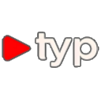

**TYP** (Tom's Youtube Premium) is an all-in-one YouTube experience that lets you bypass ads, watch videos seamlessly, and manage your downloads—all without unreliable browser extensions/setting up a pi-hole or other workarounds. With TYP, you can sync your preferences using your existing Google account or by building a personalized algorithm on YouTube that is saved to the application when not signed in.


## ✨ Features
- 🚫 **Ad-Free Viewing** – Enjoy YouTube without interruptions by streaming the video directly to the app!
- 📥 **High-Quality Video & Audio Downloads** – Save videos at the best possible quality or extract audio.
- 📁 **Built-in File Manager** – Organize, play, and manage downloaded content effortlessly.
- 🔄 **Sync with Google Account** – Maintain your watch history, recommendations, and subscriptions.
- 📺 **View Comments/Descriptions** - View comments on videos and descriptions for those that like more information intheir player
- 🖥️ **Resizable/Fullscreen/Theater Mode** - View videos at any aspect ratio - the app is stretchable and can go fullscreen or even use theater mode in app!
- 📽️ **Dynamic Resolution** - Handles dynamic resolutions always picking the best one!
- 🔴 **Live Stream and Premiere Support** - Handles live streams and premieres gracefully!

## 🪛 Upcoming Features
- Download clips of Videos instead of the whole video.
- Resize media player in saved videos.
- Fullscreen to active monitor instead of just primary


## 📸 Screenshots
 
 


## 📝 Random side notes
- Esc or F to exit/enter fullscreen
- only fullscreens to primary monitor right now

## 🛠 Installation
Follow these steps to set up and run TYP on your machine:

### 1️⃣ Download the Project
Clone the repository or download the ZIP:

```sh
git clone https://github.com/yourusername/TYP.git
cd TYP
```

### 2️⃣ Install FFmpeg and VLC
1. [Download FFmpeg](https://ffmpeg.org/download.html).
2. Extract the contents into the project directory.
3. Rename the extracted folder to `ffmpeg`.
4. [Download VLC](https://www.videolan.org/vlc/).
5. Install VLC and done!

### 3️⃣ Set Up a Virtual Environment
```sh
python -m venv venv
source venv/bin/activate  # On Windows, use `venv\Scripts\activate`
```

### 4️⃣ Install Dependencies
```sh
pip install -r requirements.txt
```

### 5️⃣ Run the Application
```sh
python run.py
```

Enjoy an ad-free, premium YouTube experience! 🚀

## 📜 License
This project is for educational purposes only and open source. Feel free to modify and please submit any useful enhancements!

## 🤝 Contributing
Pull requests are welcome! If you encounter any issues, feel free to submit them via the Issues tab.

## 📬 Contact
For support or inquiries, reach out at [https://discord.gg/safers] or open an issue on GitHub.
